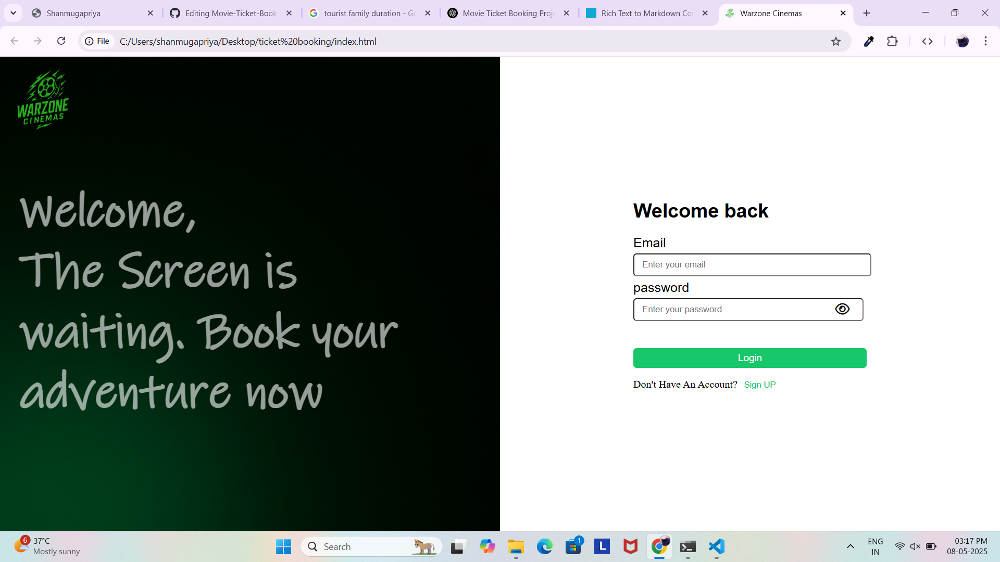
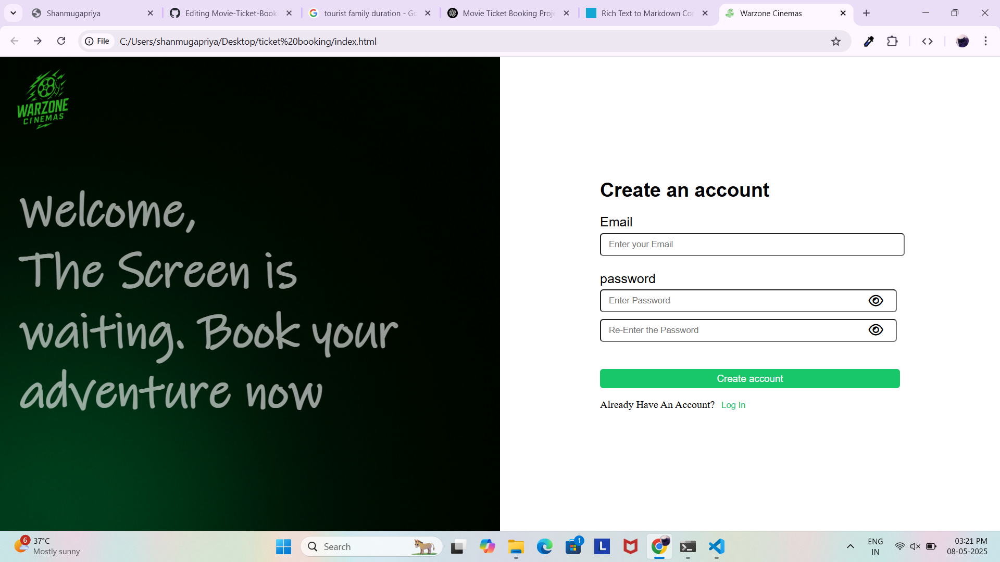
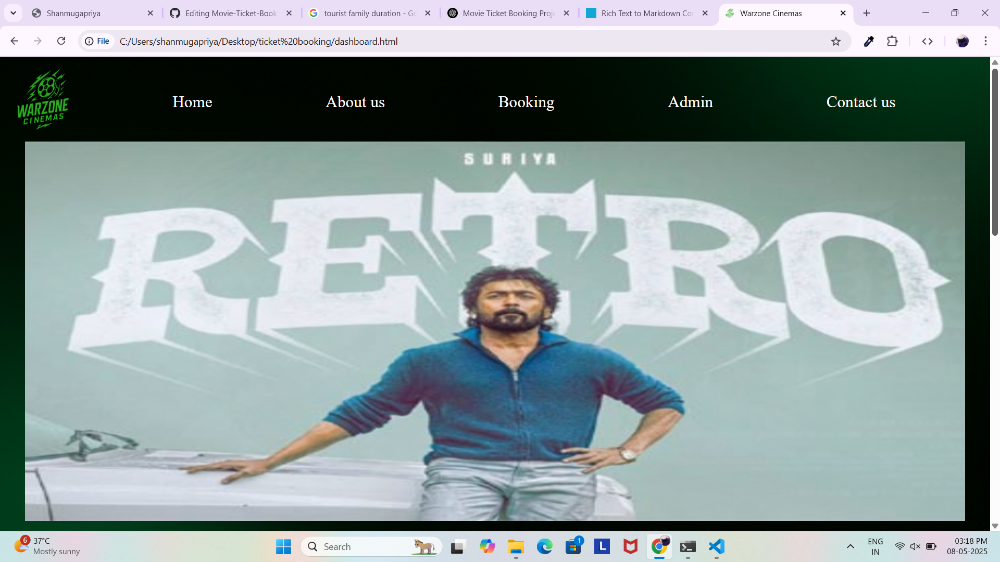
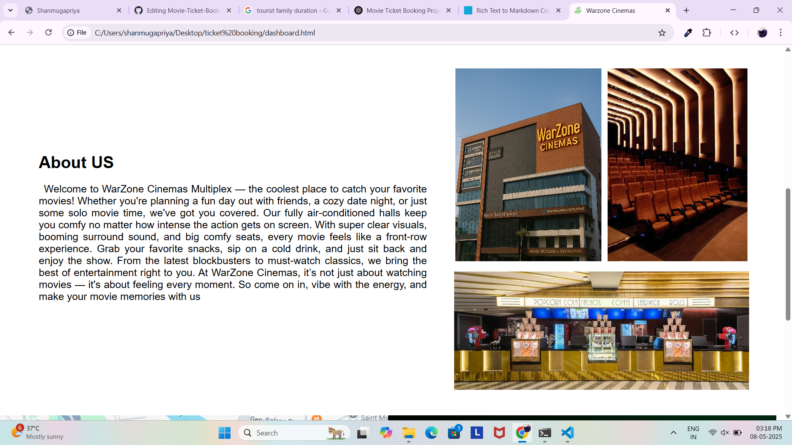
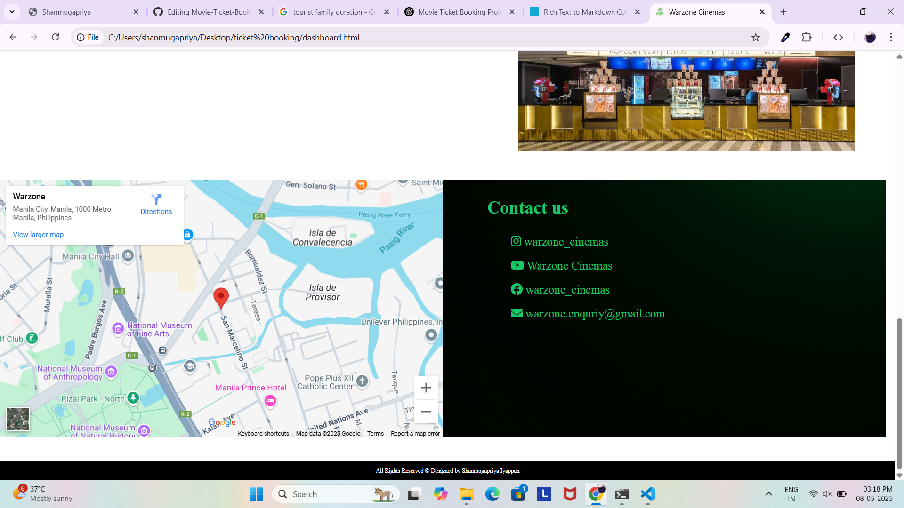
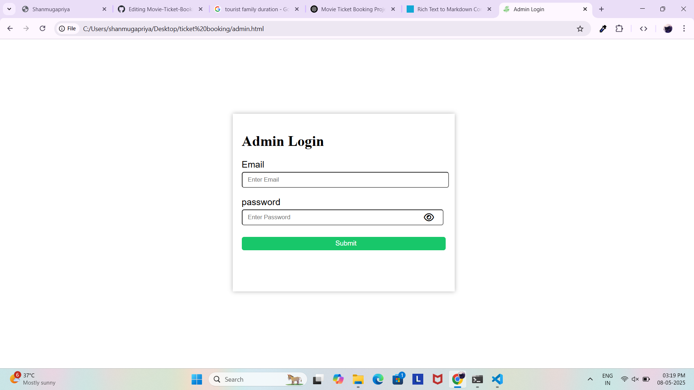
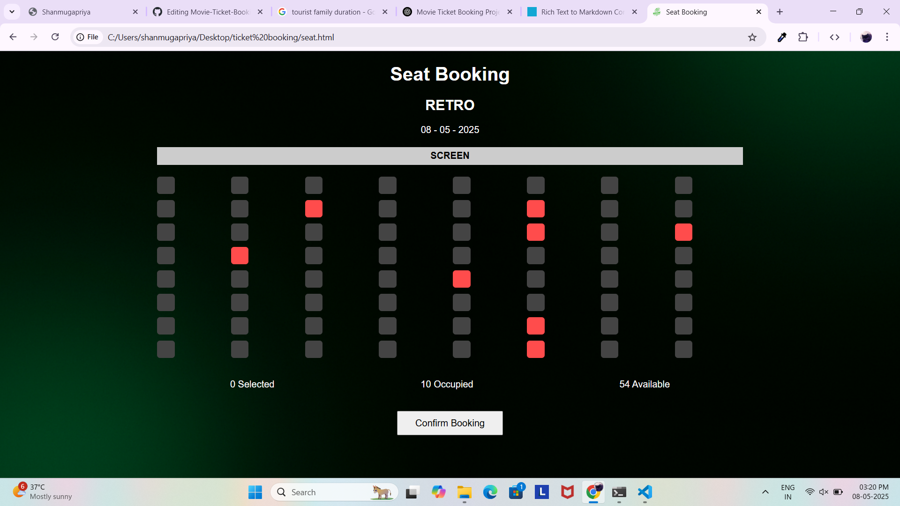

## Movie Ticket Booking Website

A simple and responsive movie ticket booking web application built using **HTML**, **CSS**, and **JavaScript**. This project allows users to select a movie, pick seats, and see the total ticket cost in real-time.

### 🔧 Features

*   🎬 Movie selection
  
*   🪑 Interactive seat selection layout
   
*   💸 Dynamic ticket pricing based on selected movie
    
*   💾 Booking data saved using localStorage 

### 💻 Tech Stack

*   **HTML** – Markup for structure
     
*   **CSS** – Styling and layout
     
*   **JavaScript** – Dynamic interactions and data handling
     

### 📸 Screenshots

